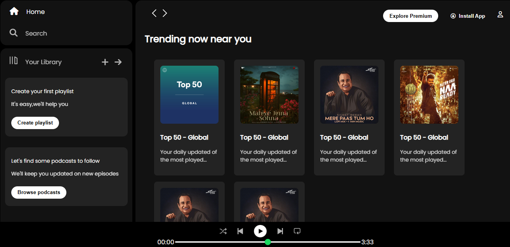

# 🎵 Spotify Clone


A simple and responsive **Spotify UI Clone** built using **HTML** and **CSS**.  

This project replicates the look and feel of the Spotify web player with a clean, dark-themed UI and modern design, featuring:

- Sidebar navigation
- Music cards
- Playback controls
- Responsive layout for different screen sizes

---

## 📸 Screenshot



---

## 🚀 Features

- 🎨 **Clean UI** inspired by Spotify's dark mode
- 📂 Sidebar navigation (Home, Search, Your Library)
- 🎶 Playlist and podcast sections
- ⏯ Music player controls at the bottom
- 📱 Responsive layout for different screen sizes

---


## 🛠️ Technologies Used

- **HTML5**: Semantic structure
- **CSS3**:
  - Flexbox for layout
  - Custom properties
  - Advanced selectors
  - Media queries for responsiveness
- **Font Awesome**: Icon integration
- **Google Fonts**: Montserrat and Poppins fonts

---

## 📂 Project Structure
```
spotify-clone/
│
├── index.html # Main HTML file
├── style.css # CSS styling for the project
├── assets/ # Images, icons, and other static files
└── README.md # Project documentation
```


## 🖊️ Author
**Hafiz Tanzeel Shamshad**
[LinkedIn Profile](https://www.linkedin.com/in/hafiz-tanzeel-shamshad-8680a8309/)

📜 License
This project is licensed under the MIT License – feel free to use and modify it.
